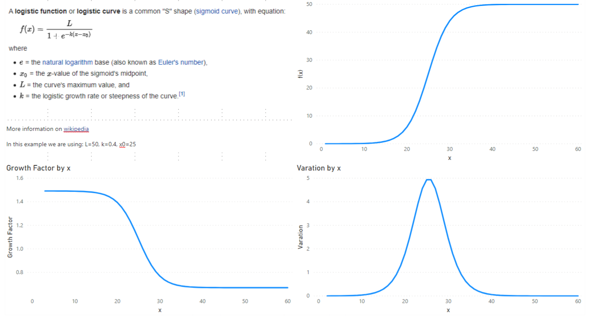
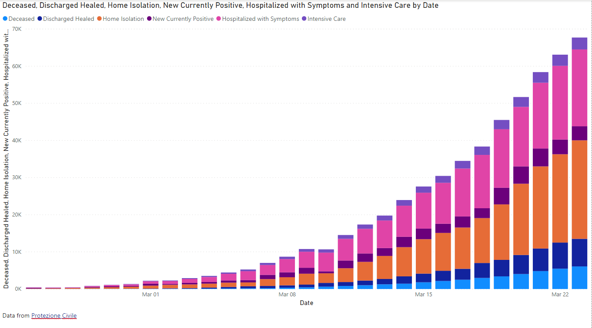
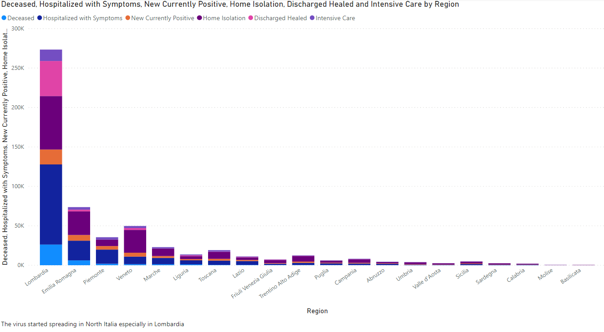
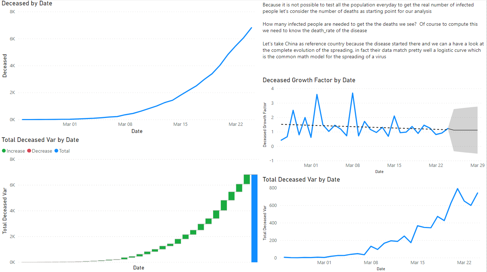
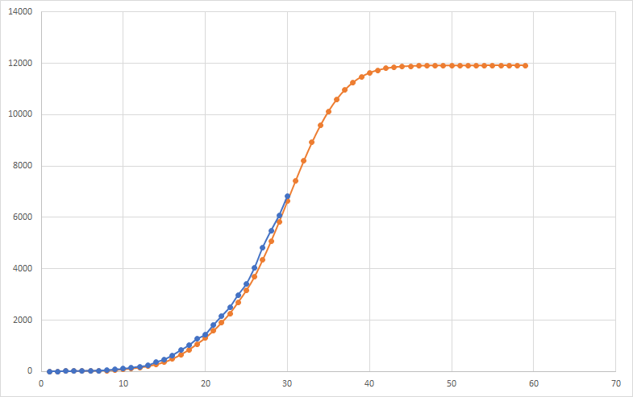

# Italy COVID-19 data analysis

## Introduction

The goal is to get some insights about the spreading of the [COVID-19](https://en.wikipedia.org/wiki/Coronavirus_disease_2019) in Italy

## Software and Libraries

To gather, model and visualize data I have used [Microsoft Power BI](https://powerbi.microsoft.com/en-us/) while for the prediction part I have used [Microsoft Excel](https://products.office.com/en/excel)

## Data

Have a look at the `data` folder and its [DATA.md](data/DATA.md) file.

## Testing

No test implemented.

## Running the code

`covid-19_italy_analysis.xlsx` can be used to check the predictions done while `covid-19_italy_analysis.pbix` can be used to check the Microsoft Power BI report

## Results

We started considering the Logistic function as model for the spreading of a virus

Italy overview

All visualization for Italy in the report are enabled to drill up/down on the location dimension

To estimate how close we are to the inflection point of a logistic curve we have looked to the Growth Factor

From there using Excel we have build a model

Deceased prediction is marked in orange while the current data are in blue

Results are better explained in this [blog post](https://medium.com/@simone.rigoni01/analyse-covid-19-spreading-in-italy-with-microsoft-excel-and-power-bi-a4ac70cb4d11)

## List of activities

In the [TODO.md](TODO.md) file you can find the list of tasks and on going activities.

## Licensing and Acknowledgements

Have a look at [LICENSE.md](LICENSE.md) and thank you [Protezione Civile](http://www.protezionecivile.gov.it/) for the datasets and for the outstanding work you are doing with [Servizio Sanitario Nazionale](http://www.salute.gov.it/portale/salute/p1_4.jsp?lingua=italiano&area=Il_Ssn) to save as many lives as possible.
Also thank you to [Humanitarian Data Exchange](https://data.humdata.org/dataset/novel-coronavirus-2019-ncov-cases) for the world data. More information about the licensing of the data can be found on their web sites
